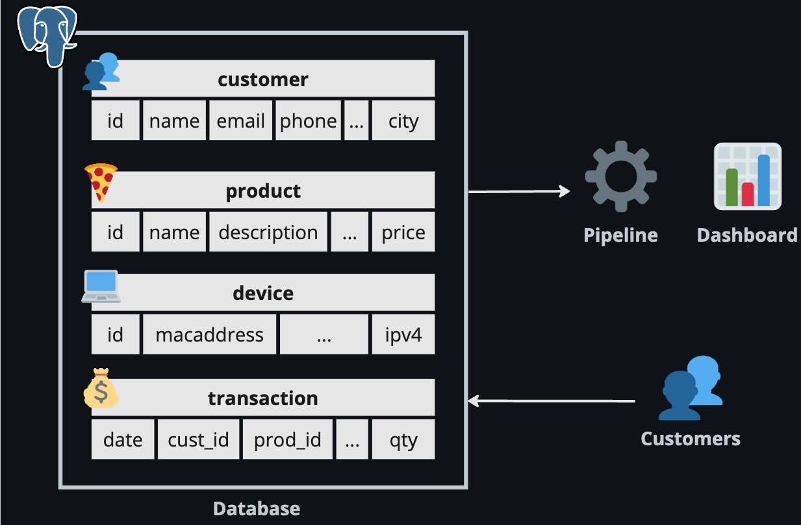
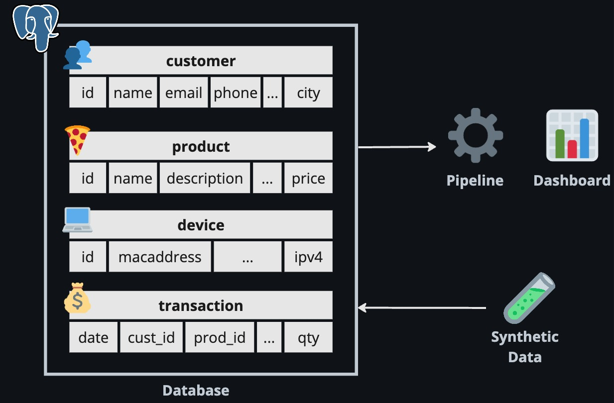
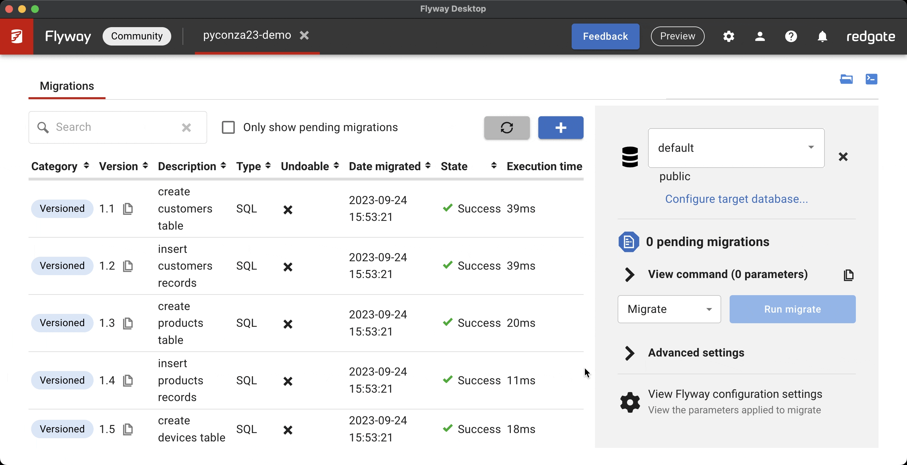
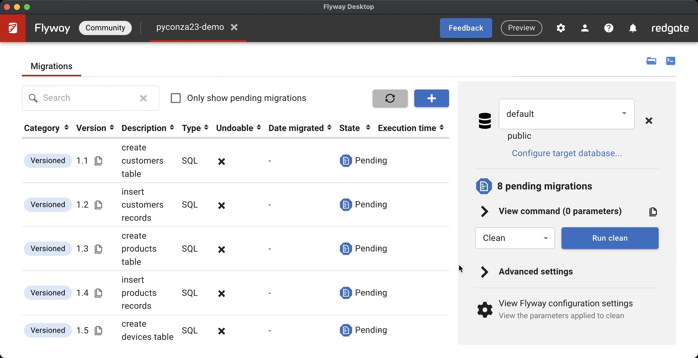

# How to build a data pipeline without data
> *Synthetic data generation and testing with Python*

---

## About me

##### Hi there, I'm Ruan Pretorius 👋

- ☕ I turn coffee into data pipelines and AI
- 🖥 I am a data scientist at *[melio.ai](https://melio.ai/)*
  - We help you build and deploy your data intensive apps to unlock value from your data, follow us on LinkedIn
- 🔗 You can find me on GitHub *[@ruankie](https://github.com/ruankie)*
- ✉️ Or contact me via email: *ruan@melio.ai*

#


---

## 🚏 Outline

- What are data pipelines and why do we need them?
- Challenges of building and testing data pipelines
- How to use synthetic data to test data pipelines
- Tools and methods to use when generating reliable synthetic data in Python
- Benefits and challenges of using synthetic data for testing data pipelines

---

## 🛠️ What is a data pipeline?

* A data pipeline is a series of operations used to extract, load, transform, validate, or write data
* From various sources into a target file system, database, or data warehouse

---

## 🔍 Data pipelines without real data

* Sometimes, we may not have access to the real data that we want to process in our data pipeline.
* It could be:
  - Sensitive or confidential and can't be shared
  - Not yet collected or available
  - Too large or complex to handle for initial testing

---

## 🔍 Data pipelines without real data

* Without real data, it is challenging to:
  - Design and build downstream apps that consume the data
  - Develop the data extract, transform, and load (ETL) logic
  - Test the functionality and performance of the data pipeline

---

## 🧪 Synthetic data to test data pipelines

* Synthetic data is artificially generated data that mimics the characteristics and behavior of real data
* Synthetic data can help us to test our data pipelines by:
  - Providing realistic sample data
  - Allowing  control of the size, shape, and distribution of the data
  - Enabling simulations of different scenarios and edge cases
  - Reducing the risk of exposing sensitive or confidential information

---

## 💃 Demo

- In this demo, I'll show you how you can create synthetic data
- Using a Python package called `Faker`
- And how to use `Flyway` to load the synthetic data into a `Postgres` database for repeatable deployments
- So that you can test your pipelines without real data


---

## 💵 Our scenario

- Let's pretend we just started a new e-commerce website
- We have an idea of what kind of data we'll have for
  - Customers
  - Products
  - Transactions

---

## 📚 The data problem



* Now we want to start building different data pipelines and visualisations to see how well our business is doing
* We want our systems to work as soon as we get customers

---

## 📚 The data problem



* But we don't have customers yet (or data for them)
* So let's make some
* Then we can build everything downstream and it should work when we get real data

---

## 🪚 Install and import tools

```shell
pip install SQLAlchemy Faker
```

* `SQLAlchemy` to create database objects
  ```python
  from sqlalchemy import Column, Integer, String, DateTime
  from sqlalchemy.orm import declarative_base
  Base = declarative_base()
  ```

* `Faker` to generate synthetic data
  ```python
  from faker import Faker
  fake = Faker()
  ```

---
## 👥 Customer object

Class to store customer information

```python
class Customer(Base):
  __tablename__ = "customers"
  id = Column(Integer, primary_key=True)
  name = Column(String(100))
  email = Column(String(100))
  phone = Column(String(25))
  address = Column(String(250))
  city = Column(String(100))
  country = Column(String(100))
```

---

## 👥 Customer data

Customer generator using `Faker` for synthetic data

```python
def generate_customer(id: int):
  customer = Customer(
      id=id,
      name=fake.name(),
      email=fake.email(),
      phone=fake.phone_number(),
      address=fake.street_address(),
      city=fake.city(),
      country=fake.country()
  )
  return customer
```

---

## 🍕 Product object

Class to store product information

```python
class Product(Base):
  __tablename__ = "products"
  id = Column(Integer, primary_key=True)
  name = Column(String(50))
  description = Column(String(200))
  category = Column(String(50))
  price = Column(Numeric(10, 2))
```
---
## 🍕 Product data

Product generator using `Faker` for synthetic data

```python
def generate_product(id: int):
  product = Product(
      id=id,
      name=fake.word(),
      description=fake.sentence(),
      category=fake.random_element(
        elements=("Electronics", "Fashion", "Books", "Games", "Sports", "Food")
      ),
      price=fake.pydecimal(left_digits=3, right_digits=2, positive=True)
  )
  return product
```
---

## 💻 Device object

Class to store device information

```python
class Device(Base):
  __tablename__ = "devices"
  id = Column(Integer, primary_key=True)
  platform = Column(String(250))
  ipv4 = Column(String(50))
  macaddress = Column(String(50))
```
---
## 💻 Device data

Device generator using `Faker` for synthetic data

```python
def generate_device(id: int):
  device = Device(
      id=id,
      platform=fake.user_agent(),
      ipv4=fake.ipv4(),
      macaddress=fake.mac_address()
  )
  return device
```
---
## 💰 Transaction object

Class to store transaction information

```python
class Transaction(Base):
  __tablename__ = "transactions"
  id = Column(Integer, primary_key=True)
  date_time = Column(DateTime)
  customer_id = Column(Integer)
  product_id = Column(Integer)
  quantity = Column(Integer)
  device_id = Column(Integer)
  payment_method = Column(String(50))
```
---
## 💰 Transaction data

Transaction generator using `Faker` for synthetic data

```python
def generate_transaction(
  id: int,
  customers: list[Customer],
  products: list[Product],
  devices: list[Device]
):
  tr = Transaction(
      id=id,
      date_time=fake.date_between(start_date=START_DATE, end_date=END_DATE),
      customer_id=random.choice(customers).id,
      product_id=random.choice(products).id,
      quantity=fake.random_int(min=1, max=20),
      device_id=random.choice(devices).id,
      payment_method=fake.random_element(
        elements=("Credit Card", "EFT", "Bitcoin", "Reward Points")
      )
  )
  return tr
```

---

## 📊 Generate data

Use our functions to generate synthetic data

```python
customers = [generate_customer(i) for i in range(1000)]
products = [generate_product(i) for i in range(60)]
devices = [generate_device(i) for i in range(1000)]

transactions = [
  generate_transaction(i, customers, products, devices) for i in range(5000)
]
```

---

## ✏️ Write data do database
> We have a choice
* Just use `SQLAlchemy` to write to our database
* Or use `Flyway` (we'll use this option)
  - It handles version control of our SQL scripts
  - And handles database migrations
    - For repeatable deployments
    - And certainty about our database state
  - This all makes it easier to collaborate with other developers


---

## 💬 Generate SQL scripts

* `Flyway` is almost like `git` for your database
* So we need to get the `CREATE` and `INSERT` statements
  - That will create our tables
  - And to insert our synthetic data

---

## 💬 Generate SQL scripts
> Create SQL string > Write to `.sql` file

* You can do some simple string manipulation:
  ```python
  sql = f"""CREATE TABLE {table} (
    id SERIAL NOT NULL, 
    name VARCHAR(100) NOT NULL
  );"""
  ```
* Or you can use `SQLAlchemy`:
  ```python
  from sqlalchemy import create_engine
  from sqlalchemy.schema import CreateTable

  engine = create_engine("postgresql:///:memory:")
  sql = str(CreateTable(cls.__table__).compile(engine))
  ```

---

## 💬 Generate SQL scripts
> Create SQL string > Write to `.sql` file

* You can do some simple string manipulation:
  ```python
  sql = f"INSERT INTO {table} VALUES ({object.id}, {object.name})"
  ```
* Or you can use `SQLAlchemy`:
  ```python
  from sqlalchemy.sql.expression import insert

  insert_stmt = insert(cls.__table__)\
    .values(records)\ # list of records from helper function
    .compile(compile_kwargs={"literal_binds": True})
  sql = str(insert_stmt)
  ```

---

## 🪽 Use Flyway to create tables and data
> Install the CLI ([instructions online](https://documentation.red-gate.com/fd/command-line-184127404.html))

* Configure Flyway by creating a new project and specifying database connections

* Drop all tables, views, procedures etc. in the configured schemas to start fresh
  ```shell
  flyway clean
  ```

* Migrate schemas to the latest version by applying SQL scripts
  ```shell
  flyway migrate
  ```

---

## 🪽 Use Flyway to create tables and data
> After downloading and installing Flyway Desktop

* Configure Flyway by creating a new project and specifying database connections

---

## 🪽 Use Flyway to create tables and data
> To start fresh, perform a `clean` to drop all tables, views, procedures etc. in the configured schemas



---

## 🪽 Use Flyway to create tables and data
> Perform a `migrate` to update schemas to the latest version by applying SQL scripts



---

## 👀 Inspect data
> Inspect database with `pgAdmin` to see if your synthetic data is ready


---

## ⚖️ Pros and cons of synthetic data

* Benefits:
  - It can speed up the development and testing process
  - It can increase the coverage and quality of testing
* Challenges & limitations:
  - It may not capture all the nuances and variations of real data
  - It may require additional effort and resources to create and maintain synthetic data

---

## 💡 Tips & best practices

* Define the scope and purpose of your synthetic data before starting
* Be careful of wasting time trying to make perfectly realistic data
* Use existing tools and libraries to generate synthetic data where possible
* Validate and verify your synthetic data against your real data schema and business rules
* Document your synthetic data generation process and code

---

# 📜 Summary

* We discussed some challenges of building and testing data pipelines without real data
* We learned how to build synthetic data in Python to test our data pipelines
* We also showed how we used Flyway to load the synthetic data into a Postgres database

---

#

## <!--fit--> 🐍 Thank you!

#

- 🔗 GitHub: *[@ruankie](https://github.com/ruankie)*
- ✉️ Email: *ruan@melio.ai*
- 🏠 Melio website: *[melio.ai](https://melio.ai)*

  
